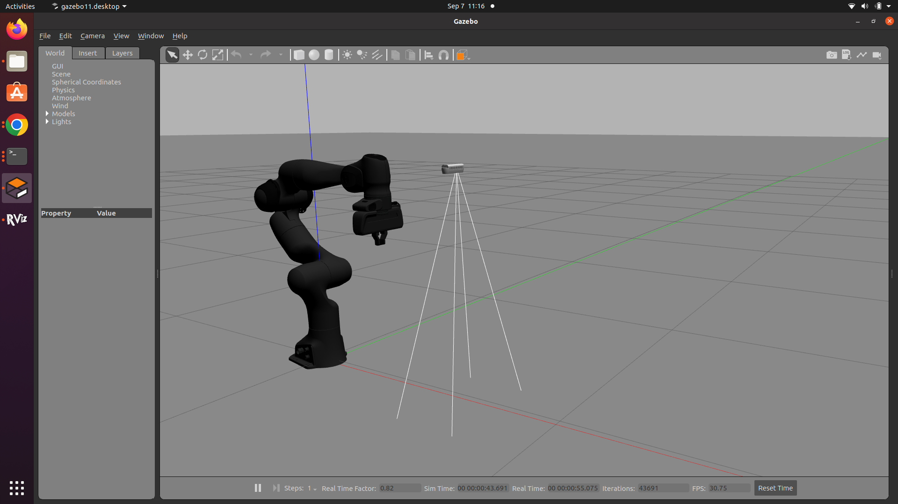
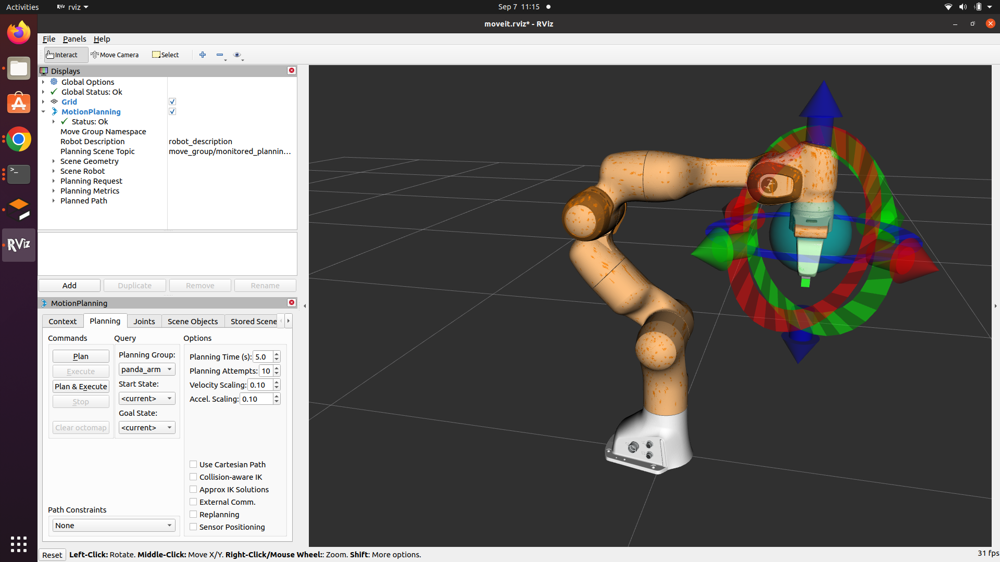

# Perception-based-robotic-arm-grasping
Hello, I am Nitin, and I am currently documenting a project on Perception-Based Robot Manipulation and Grasping. In this project, I am utilizing the Panda Emika robotic arm in conjunction with the Intel RealSense D435 Depth camera. Initially, I implemented a Depth camera Plugin for simulation, attaching the camera to the world frame space. The primary objective is to use this camera to aid in detecting the grasp pose for object manipulation. Motion planning will be performed using the MoveIt API.

### **Steps to Follow for executions:**
* Install Moveit on your system from this link : [Moveit](https://ros-planning.github.io/moveit_tutorials/doc/getting_started/getting_started.html)
   * You can try checking if Moveit install correctly by running this command in terminal, after sourcing the workspace:
     `roslaunch panda_moveit_config demo_gazebo.launch` this should open rviz and gazebo with moveit configuration for           panda emika robotic arm:
     This should open the Gazebo with robotic arm but without rgbd camera and rviz with moveit configuration:
     
     
     
     
* Fork this Repo: `https://github.com/thakkarnitin63/Perception-based-robotic-arm-grasping.git`
* In Repo, I have got Intel Realsense Plugin get that folder outside this folder(Perception-based-robotic-arm-grasping):`realsense_ws`
  * Open terminal follow this command `cd realsense_ws` then `catkin make` this will build the catkin package       and your intel realsense plugin will start working to simulate the depth camera in gazebo since we are not      using real hardware
  * Now, `cd rgbd_ws` and do catkin make using `catkin make` after that you will have working workspace for realsense and rgbd workspace.
  * Installation for Franka ros robotic arm files `sudo apt install ros-noetic-libfranka ros-noetic-franka-ros` run this command to get install franka ros files so we can later on change this files to attch camera module to robotic arm.
  * Locate `franka_description` in your `computer/opt/ros/noetic/share/` go to `franka_description/robots/panda/` and perform this changes to given file by the name `panda.urdf.xacro`.
  

    

**Author-Nitin Thakkar**
